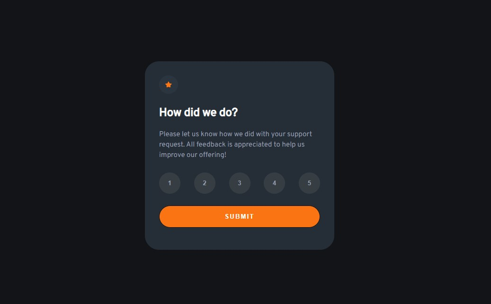

# Frontend Mentor - Interactive rating component solution

This is a solution to the [Interactive rating component challenge on Frontend Mentor](https://www.frontendmentor.io/challenges/interactive-rating-component-koxpeBUmI). Frontend Mentor challenges help you improve your coding skills by building realistic projects.

## Table of contents

- [Overview](#overview)
  - [The challenge](#the-challenge)
  - [Screenshot](#screenshot)
  - [Links](#links)
  - [Built with](#built-with)
- [Author](#author)

**Note: Delete this note and update the table of contents based on what sections you keep.**

## Overview

### The challenge

Users should be able to:

- View the optimal layout for the app depending on their device's screen size
- See hover states for all interactive elements on the page
- Select and submit a number rating
- See the "Thank you" card state after submitting a rating

### Screenshot

### Links

- Solution URL: https://github.com/Odalloc/interactive-rating-component.git
- Live Site URL: https://odalloc.github.io/interactive-rating-component/

### Built with

- Semantic HTML5 markup
- CSS Sass
- Flexbox
- Mobile-first workflow
- Vanilla Javascript

## Author

- Frontend Mentor - [@Odalloc](https://www.frontendmentor.io/profile/Odalloc)
- Linkedln - [@MACollado](https://www.linkedin.com/in/maria-andrea-collado-b7533b23a/)
